# Computer Vision with Tensorflow, Keras and OpenCV

  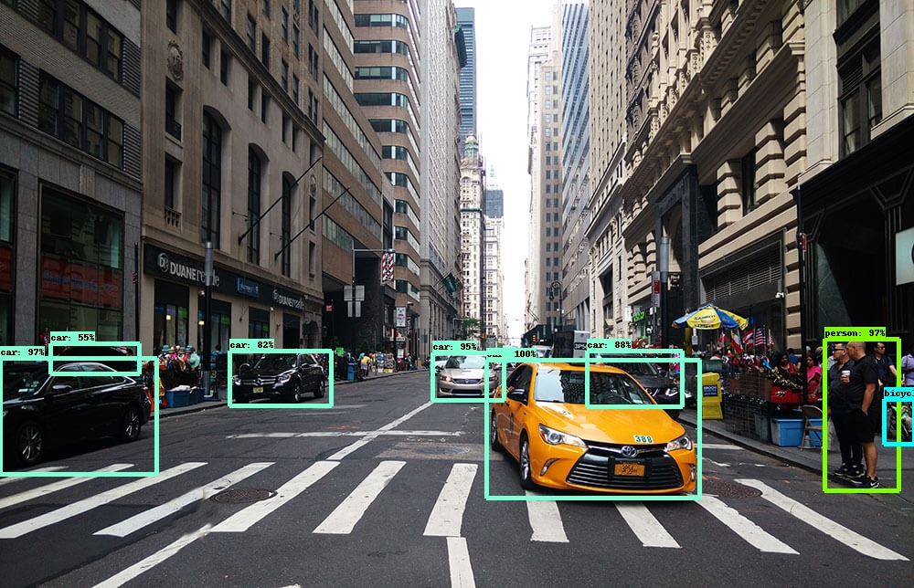
  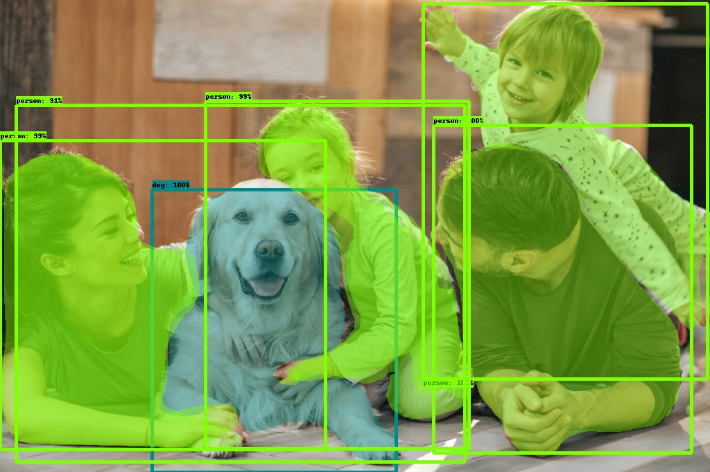 

## Purpose
Make available Computer Vision model applications in web app format. The following topics were approached:
- Image object detection and classification
- Image object segmentation
- AutoEncoder (neural network model applied for image noise reduction)
- Image filters application with OpenCV

## Project links
- https://share.streamlit.io/rafaelcoelho1409/computervision/object_detection.py (Image object detection and classification)  
- https://share.streamlit.io/rafaelcoelho1409/computervision/image_segmentation.py (Image object segmentation)
- https://share.streamlit.io/rafaelcoelho1409/computervision/opencv1.py (Computer Vision application with OpenCV)  
OBS: Due to Streamlit Cloud limitations, this repo takes up a lot of internal storage memory from Streamlit Cloud, then the cloud processing of this repository to make available these applications, with its limited memory, crashes the page and then, it doesn't work.  
The only app that works with no limitations on Streamlit Cloud is the third (Computer Vision application with OpenCV), so all apps here only work locally (instructions below about how to run this repo locally in your machine).

## Resources
- Visual Studio Code
- python3.8.8
- virtualenv
- pip3: python3.x packages manager

## Python packages
- streamlit
- tensorflow
- tensorflow.keras
- tensorflow_hub
- plotly
- time
- PIL
- cv2 (OpenCV)
- object_detection (Tensorflow Object Detection API)

## Topics approached in this project
- Object detection and classification with Tensorflow Object Detection API
- Image segmentation
- Convolutional AutoEncoder (neural network model)
- Image filters from OpenCV
- Object detection and classification with OpenCV (republished)

## Running this repo in your local machine
- clone this repo:  
> git clone https://github.com/rafaelcoelho1409/DeepLearning.git
- install required packages that are in 'requirements.txt' file:
> pip3 install -r requirements.txt
- choose your Python interpreter (python3.x)  
- run the following commands (for Linux):
> cd DeepLearning  
> streamlit run {app_name}.py (change {app_name} for object_detection.py, image_segmentation.py, opencv1.py)  
- With these commands, the web page will be opened automatically. In the case it doesn't open, go to the browser and type:
> http://localhost:8501  

## Screenshots
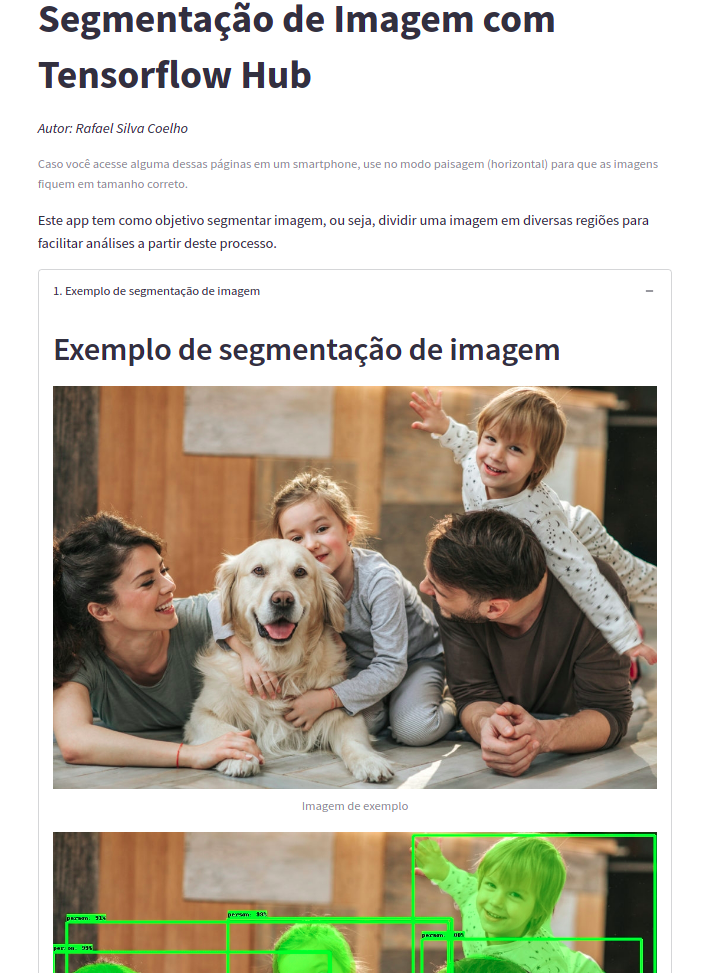
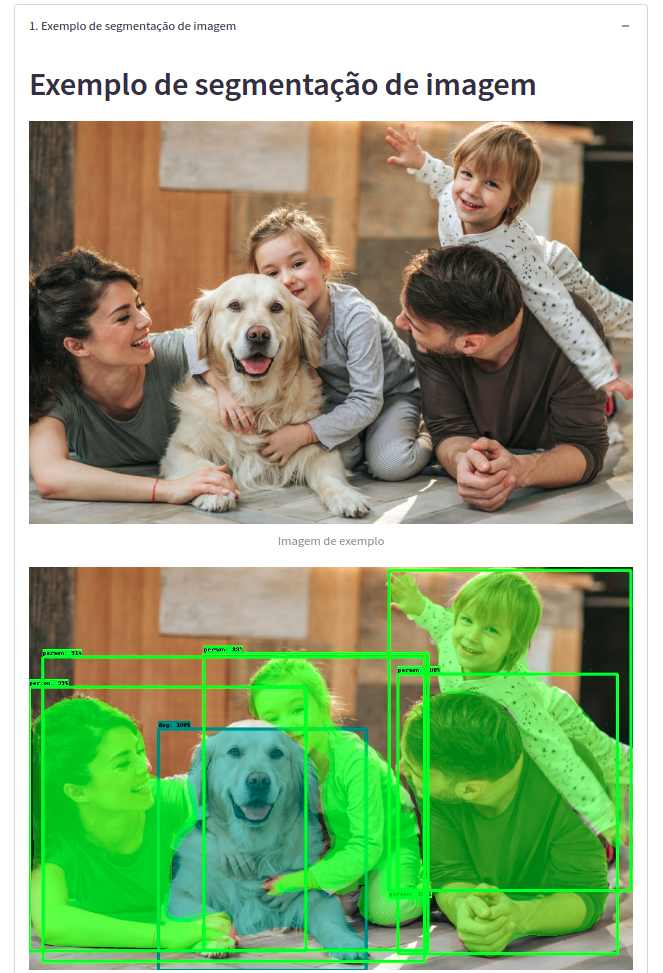
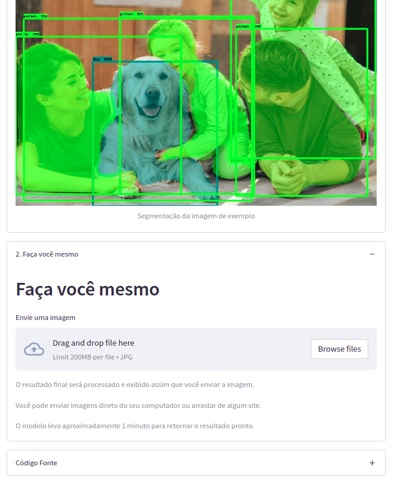
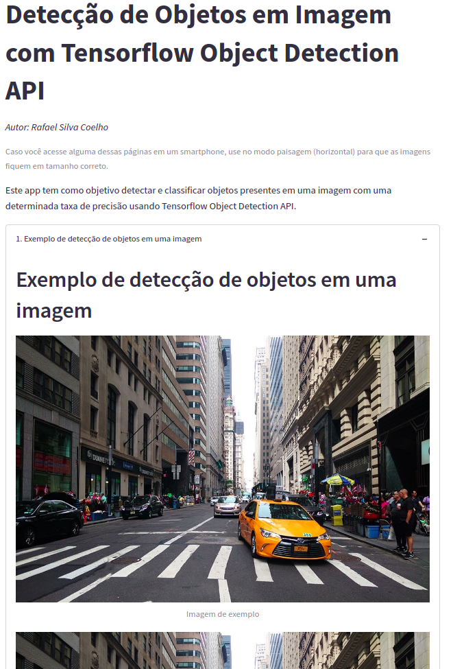
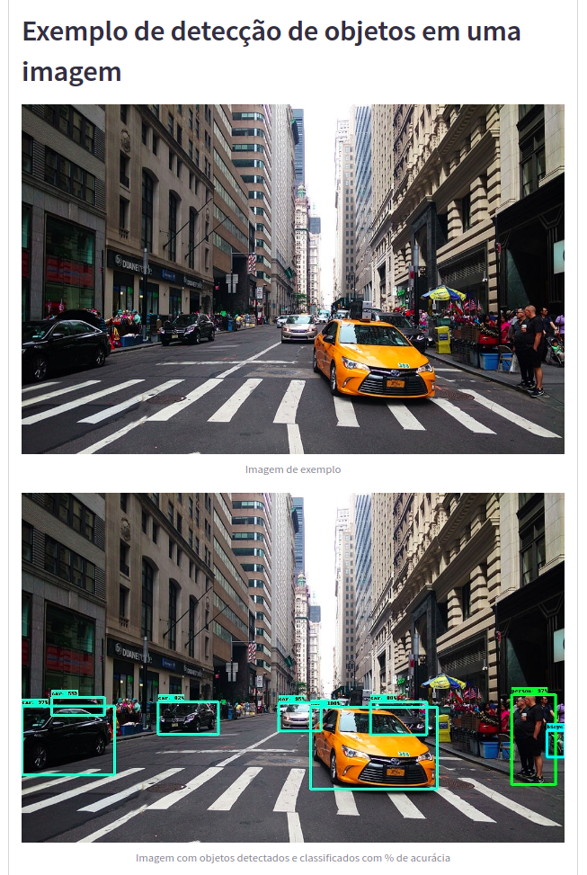
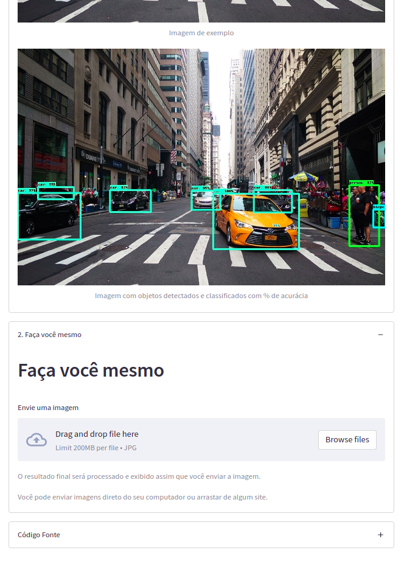
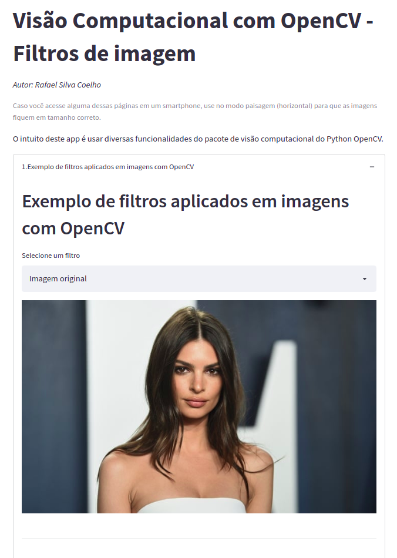
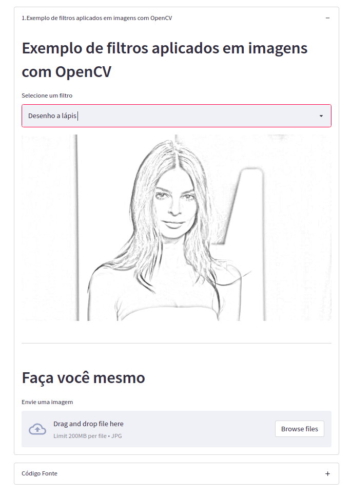
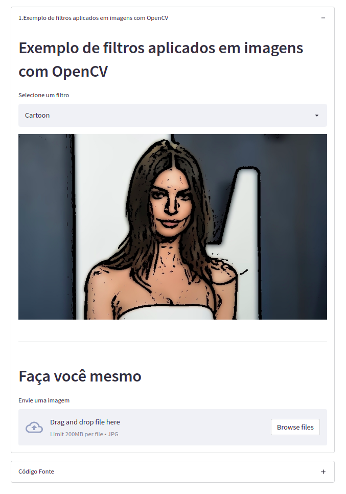
